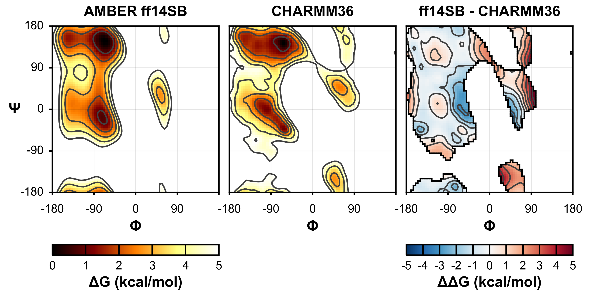

Introduction
============
Ramaplot is a Python program used to generate `Ramachandran plot
<https://en.wikipedia.org/wiki/Ramachandran_plot>`_ figures using matplotlib.
Ramachandran plots are a powerful method of visualizing the distribution of
backbone Φ and Ψ dihedral angles in peptides and proteins, or of other
properites as a function of Φ and Ψ. Ramaplot configuration is powered by
`myplotspec <http://karltdebiec.github.io/myplotspec>`_, enabling powerful
configuration options from `YAML
<http://www.yaml.org/spec/1.2/spec.html>`_-format text files. Several types of
experimental and simulated datasets are currently supported.

Supported Datasets
------------------

Experiment
~~~~~~~~~~

Neighbor-Dependent Ramachandran Distributions
_____________________________________________
The Neighbor-Dependent Ramachandran Distribution (NDRD) dataset is a collection
of Φ/Ψ probability distributions measured from the loop (non-α/β) regions of
solved structures. In addition to distributions for all 20 amino acids, left-
and right-neighbor distributions are available for each pair of amino acids,
which may be used to calculate distributions of each amino-acid triplet. The
complete dataset includes residues identified as turn, coil, bridge, π helix,
and 310 helix; versions including only turn, coil, and bridge, only turn, and
only coil are available as well. This dataset may be obtained from
`<http://dunbrack.fccc.edu/ndrd>`_.

`Ting, Daniel, Wang, Guoli, Shapovalov, Maxim, Mitra, Rajib, Jordan, Michael I,
Dunbrack Jr. Roland L. Neighbor-Dependent Ramachandran Probability
Distributions of Amino Acids Developed from a Hierarchical Dirichlet Process
Model. PLoS Computational Biology. 2010. 6. e1000763.
<http://journals.plos.org/ploscompbiol/article?id=10.1371/journal.pcbi.1000763>`_

Conformation-Dependent Library
______________________________
The Conformation-Dependent Library (CDL) dataset is a collection of averages
and standard deviations of backbone bond lengths and angles as a function of Φ
and Ψ, measured from solved structures. The dataset is divided into 8 classes:
isoleucine/valine, glycine, proline, and all other residues, each leading into
proline or residues other than proline. This dataset may be obtained from
`<http://dunbrack.fccc.edu/nmhrcm>`_. (Work in progress)

`Berkholz, Donald S., Shapovalov, Maxim V., Dunbrack Jr. Roland L., Karplus, P.
Andrew. Conformation Dependence of Backbone Geometry in Proteins. Structure.
2009. 17. 1316-1325.
<http://www.sciencedirect.com/science/article/pii/S0969212609003359>`_

Simulation
~~~~~~~~~~

Molecular Dynamics Simulation
_____________________________
The distribution of observed Φ and Ψ dihedral angles from a molecular dynamics
simulation may be calculated from a text file containing a timeseries,
typically calculated from the trajectory using `cpptraj
<https://github.com/Amber-MD/cpptraj>`_. Alternatively, the average value of
another property as a function of Φ and Ψ may be calculated. (Work in
progress)

`Roe, Daniel R., Cheatham III, Thomas E. PTRAJ and CPPTRAJ: Software for
Processing and Analysis of Molecular Dynamics Trajectory Data. Journal of
Chemical Theory and Computation. 2013. 93084–3095.
<http://pubs.acs.org/doi/abs/10.1021/ct400341p>`_

Umbrella Sampling/Weighted Histogram Analysis Method
____________________________________________________
As an alternative to brute-force sampling of a simulated protein system using a
long continuous unbiased trajectory, it is possible to obtain comparable
results in less simulation time using the Umbrella Sampling method of enhanced
sampling. In this method, the system is restrained to selected values along one
or more coordinates of interest (such as the Φ and Ψ dihedral angles),
typically using a harmonic restraint. Provided that the sampling within each
'window' overlaps with its neighbors, the true free energy of the system as a
function of the chosen coordinate(s) may be subsequently calculated using the
`Weighted Histogram Analysis Method (WHAM)
<http://membrane.urmc.rochester.edu/content/wham>`_

`Grossfield, Alan. WHAM: The Weighted Histogram Analysis Method. Version 2.0.9.
<http://membrane.urmc.rochester.edu/content/wham>`_

Molecular Mechanics Force Fields
________________________________
The distribution of Φ and Ψ dihedral angles sampled in a molecular dynamics
simulation are a function of the force field parameters used, in particular the
fourier series used to model the potential energy surface along Φ and Ψ. These
parameters may be loaded from an `Amber-format force field
<http://ambermd.org/#ff>`_ (parm*.dat).
(Work in progress)

Images
~~~~~~
In order to enable more direct comparison to published Ramachandran plots,
Ramaplot supports plotting of image files.

Example Usage
-------------

The example output shown above may be generated using the following command

::

    python Ramaplot.py -yaml examples/example.yml

example.yml
~~~~~~~~~~~

::

    figures:
        0:
            preset: notebook_3
            outfile: examples/example.png
            savefig_kw:
                dpi: 300
            subplots:
                0:
                    title: "AMBER ff14SB"
                    datasets:
                        0:
                            kind: wham
                            infile: examples/ff14SB.dat
                1:
                    title:  "CHARMM36"
                    datasets:
                        0:
                            kind:   wham
                            infile: examples/charmm36.dat
                2: 
                    preset: diff
                    title: "ff14SB - CHARMM36"
                    datasets: 
                        0:
                            dataset_1_kw:
                                kind: WHAM
                                infile: examples/ff14SB.dat
                            dataset_2_kw:
                                kind: WHAM
                                infile: examples/charmm36.dat

Dependencies
------------
Ramaplot supports Python 2.7 and 3.4, and requires the following packages:

- matplotlib
- numpy
- pandas
- six
- yaml

Ramaplot has been tested with Anaconda Python 2.2.0 on Arch Linux, OSX
Yosemite, and Windows 8.1.

Authorship
----------
Ramaplot is developed by Karl T. Debiec, a graduate student at the University
of Pittsburgh advised by Professors Lillian T. Chong and Angela M.
Gronenborn.

License
-------
Released under a 3-clause BSD license.
